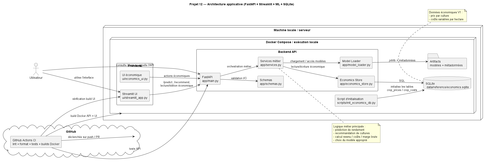

# Projet 12 — Agritech Yield Prediction & Crop Recommendation

Application agritech de **prédiction de rendement agricole** et de **recommandation de culture**.

Le projet combine :
- un **backend FastAPI** pour la logique métier,
- une **interface Streamlit** pour l’usage utilisateur,
- des **modèles de machine learning** déjà entraînés,
- une **base SQLite modifiable** pour les données économiques,
- une exécution locale classique ou via **Docker Compose**,
- une **CI GitHub Actions** pour sécuriser le code.

---

## Objectif du projet

L’application permet de :

1. **Prédire le rendement d’une culture**
   - rendement estimé par hectare,
   - rendement total sur la parcelle,
   - marge d’erreur,
   - revenu estimé,
   - marge brute estimée.

2. **Recommander les cultures les plus intéressantes**
   - en combinant la prédiction agronomique,
   - puis une couche économique simple :
     - prix de vente,
     - coûts variables par hectare,
     - marge brute estimée.

3. **Modifier les données économiques**
   - via une base SQLite,
   - pour tester différents contextes de marché.

---

## Stack technique

### Backend
- **FastAPI**
- **Pydantic**
- **SQLite**

### Frontend
- **Streamlit**

### Data / ML
- **scikit-learn**
- **CatBoost**
- **XGBoost**
- **pandas / numpy**

### Dev / Ops
- **uv**
- **Docker / Docker Compose**
- **Ruff**
- **Pytest**
- **GitHub Actions**

---

## Architecture du projet

```text
Projet-12/
├── app/
│   ├── main.py
│   ├── model_loader.py
│   ├── schemas.py
│   ├── services.py
│   └── economics_store.py
├── ui/
│   ├── streamlit_app.py
│   ├── economics_ui.py
│   └── __init__.py
├── scripts/
│   └── init_economics_db.py
├── data/
│   └── reference/
│       └── economics.sqlite
├── artifacts/
│   ├── ...
│   └── modèles + métadonnées
├── tests/
│   ├── conftest.py
│   └── test_api.py
├── Dockerfile.api
├── Dockerfile.ui
├── docker-compose.yml
├── .dockerignore
├── pyproject.toml
├── uv.lock
└── README.md
````
## Diagramme d’architecture

Le diagramme suivant présente l’organisation logique de l’application, les échanges entre l’interface Streamlit, l’API FastAPI, les artefacts de modèles et la base SQLite.



---

## Fonctionnement global

### 1. Prédiction

L’utilisateur fournit :

* une culture,
* une surface de parcelle (`parcel_area_ha`),
* une zone/pays (`area`),
* éventuellement des données climatiques,
* et des informations simples sur fertilisation et irrigation.

Le backend :

* choisit le modèle approprié,
* prédit un rendement en **tonnes / hectare**,
* calcule le rendement total sur la parcelle,
* lit les données économiques actives,
* calcule :

  * revenu estimé,
  * coûts variables estimés,
  * marge brute estimée.

### 2. Recommandation

Le backend :

* évalue plusieurs cultures candidates,
* calcule leur rendement prédit,
* applique les données économiques,
* classe les cultures selon la **marge brute estimée**.

### 3. Données économiques

Une base SQLite stocke :

* les **prix par culture**,
* les **coûts par hectare**.

Ces données sont visibles et modifiables depuis l’interface Streamlit.

---

## Données économiques

La logique économique V1 repose sur deux tables SQLite :

* `crop_prices`
* `crop_costs`

### Prix

On stocke par culture :

* une valeur de prix,
* une unité (ex. `usd_per_tonne`),
* une devise,
* une source,
* une date d’observation,
* un statut par défaut / surcharge utilisateur.

### Coûts

On stocke par culture :

* coût semences / ha,
* coût pesticides / ha,
* coût fertilisants / ha,
* coût irrigation / ha,
* autres coûts / ha.

### Résultat économique

Le système calcule ensuite :

* **revenu estimé**
* **coûts variables estimés**
* **marge brute estimée**

> Dans la V1, si les coûts restent à zéro, la marge brute estimée est égale au revenu brut estimé.

---

## Lancement local

### 1. Installer les dépendances

```bash
uv sync
```

### 2. Initialiser la base économique

```bash
uv run python scripts/init_economics_db.py
```

### 3. Lancer l’API FastAPI

```bash
uv run uvicorn app.main:app --reload --host 127.0.0.1 --port 8000
```

Documentation Swagger :

```text
http://127.0.0.1:8000/docs
```

### 4. Lancer Streamlit

```bash
uv run streamlit run ui/streamlit_app.py
```

Interface Streamlit :

```text
http://127.0.0.1:8501
```

---

## Lancement avec Docker

### Build + run

```bash
docker compose up --build
```

### Accès

* API : `http://127.0.0.1:8000/docs`
* Streamlit : `http://127.0.0.1:8501`

### Arrêt

```bash
docker compose down
```

---

## Endpoints principaux

### `GET /health`

Vérifie l’état de chargement des modèles.

### `POST /predict`

Prédit le rendement et les sorties économiques pour une culture donnée.

Exemple de payload :

```json
{
  "crop": "Rice",
  "area": "India",
  "parcel_area_ha": 10,
  "rainfall_mm": 900,
  "temperature_celsius": 22,
  "fertilizer_used": true,
  "irrigation_used": true
}
```

### `POST /recommend`

Retourne les cultures recommandées selon la **marge brute estimée**.

Exemple de payload :

```json
{
  "area": "India",
  "parcel_area_ha": 10,
  "rainfall_mm": 900,
  "temperature_celsius": 22,
  "fertilizer_used": true,
  "irrigation_used": true,
  "top_k": 5
}
```

---

## Interface Streamlit

L’interface contient 3 onglets :

### 1. Prédiction

Permet :

* de choisir une culture,
* de saisir les variables d’entrée,
* d’obtenir :

  * rendement / ha,
  * rendement total,
  * revenu estimé,
  * marge brute estimée,
  * niveau de confiance,
  * avertissements éventuels.

### 2. Recommandation

Permet :

* de recommander plusieurs cultures,
* de comparer leurs marges brutes estimées,
* d’identifier les cultures sans données économiques actives.

### 3. Données économiques

Permet :

* de visualiser les prix actifs,
* de visualiser les coûts actifs,
* d’ajouter / modifier des prix,
* d’ajouter / modifier des coûts par hectare.

---

## Tests

Les tests actuels couvrent le socle API :

* `/health`
* `/predict`
* `/recommend`

Lancement :

```bash
uv run pytest -q
```

---

## Qualité de code

### Vérification Ruff

```bash
uv run ruff check app ui scripts src project_paths.py tests
```

### Formatage

```bash
uv run ruff format app ui scripts src project_paths.py tests
```

---

## CI GitHub Actions

La CI vérifie automatiquement :

* synchronisation des dépendances avec `uv`,
* lint Ruff,
* format Ruff,
* tests Pytest,
* build Docker API,
* build Docker UI.

Workflow :
`.github/workflows/ci.yml`

---

## Décisions de modélisation retenues

À ce stade du projet :

* le **modèle Ridge de référence** est conservé ;
* les explorations supplémentaires n’ont pas apporté de gain suffisant pour remplacer le modèle actuel ;
* l’API n’a donc pas été cassée pour intégrer un nouveau modèle ;
* la valeur ajoutée principale de la V1 vient de :

  * la couche économique,
  * la recommandation métier,
  * l’interface utilisateur.

---

## Limites actuelles

* la qualité de la recommandation dépend directement de la qualité des **prix** et **coûts** saisis ;
* certaines cultures peuvent manquer de données économiques actives ;
* la marge brute estimée reste une approximation simplifiée ;
* la V1 n’intègre pas encore une gestion avancée des unités, devises ou historiques de marché ;
* les coûts par défaut sont initialisés simplement et doivent être enrichis pour un usage métier plus réaliste.

---

## Pistes d’amélioration

* gestion plus fine des alias de noms de cultures,
* enrichissement automatique des données économiques,
* historique des prix et des coûts,
* édition plus avancée dans Streamlit,
* graphiques comparatifs dans l’UI,
* déploiement distant,
* monitoring plus complet.

---

## Auteur

Thomas Auvin
Projet réalisé dans le cadre de la formation **Data Scientist OpenClassrooms**.

---
